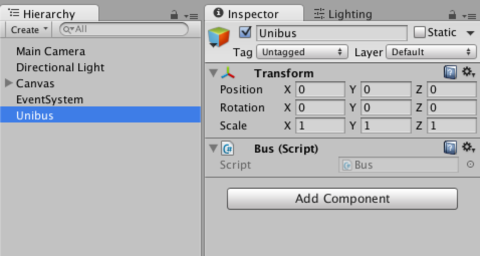

# Unibus


Unibus is event passing system for Unity3D.
It is inspired by EventBus.

# Why Unibus?

Unity is great framework for creating game, but there is no standard event passing system.

For example in GameJam, there is no time to implement and need to write so many singleton.

So I create instant event passing system.

It's easy to use, thin dependency, flexible to fit any type of message.

# Install

Download [Unibus-v0.0.1.unitypackage](https://github.com/mattak/Unibus/releases/download/0.0.1/Unibus-v0.0.1.unitypackage)

# Usage

## 1. place bus object

Place gameobject and attach `Bus.cs` script.
It will be singleton to refer event.



Then it's ready to use.

## 2. Implement event sender

Send any event what you want such as `SampleEventSender.cs` .

```
using Unibus;

public class SampleEventSender : MonoBehaviour
{
    void OnClick()
    {
        // Send string message
        Bus.Instance.Dispatch("message");
    }
}
```

## 3. Implement event receiver

Receive sent message such as `SampleEventReceiver.cs` .

```
using Unibus;

public class SampleEventReceiver : MonoBehavour
{
    void OnEnable()
    {
        Bus.Instance.Subscribe(OnEvent);
    }

    void OnDisable()
    {
        Bus.Instance.Unsubscribe(OnEvent);
    }

    // This is receiver 
    void OnEvent(string message)
    {
        var text = this.GetComponent<Text>();
        text.text = message;
    }
}
```

Or you can use simple style subscriber.
`AddEnableTo()` is shortcut to unsubscribe automatically when gameobject reach `onDisable()`.

```
using Unibus;

public class SampleEventReceiver : MonoBehavour
{
    void OnEnable()
    {
        Bus.Instance.AddEnableTo((string message) => { this.GetComponent<Text>().text = message; });
    }
}
```

## Sending Object

It's able to send any type of object.

```
// Subscribe
Bus.Instance.AddEnableTo((int value) => {});
Bus.Instance.AddEnableTo((string value) => {});
Bus.Instance.AddEnableTo((Person value) => {});

// Dispatch
Bus.Instance.Dispatch(0);
Bus.Instance.Dispatch("message");
Bus.Instance.Dispatch(new Person("john", "due"));
```

## Tagging

Divide same type of object event by attaching tag.

```
// Subscribe
Bus.Instance.AddEnableTo("HP", (int value) => {});
Bus.Instance.AddEnableTo("MP", (int value) => {});

// Dispatch
Bus.Instance.Dispatch("HP", 100);
Bus.Instance.Dispatch("MP", 200);
```

# License

[MIT](./LICENSE.md)
