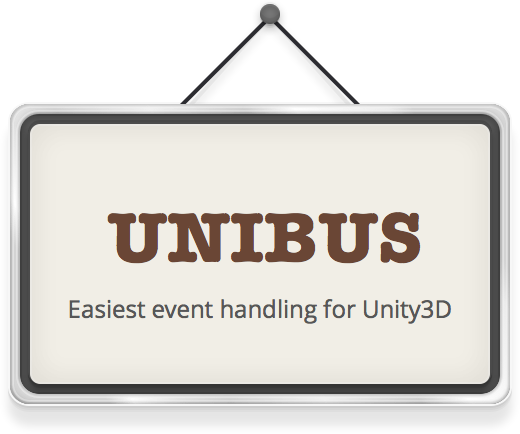

# Unibus



Unibus is event passing system for Unity3D.
It is inspired by EventBus.

# Why Unibus?

Unity is great framework for creating game, but there is no standard event passing system.
For example in GameJam, there is no time to implement and need to write so many singleton.
So I create instant event passing system.
It's easy to use, thin dependency, flexible to fit any type of message.

# Install

Download [Unibus-v0.0.1.unitypackage](https://github.com/mattak/Unibus/releases/download/0.0.1/Unibus-v0.0.1.unitypackage)

# Usage

Implement two class, receiver and sender.

EventSender.cs

```
using Unibus;

public class EventSender : MonoBehaviour
{
    void OnClick()
    {
        // Send string Event
        Bus.Instance.Dispatch("message");
    }
}
```

EventReceiver.cs

```
using Unibus;

public class EventReceiver : MonoBehavour
{
    void OnEnable()
    {
        Bus.Instance.Subscribe(OnEvent);
    }

    void OnDisable()
    {
        Bus.Instance.Unsubscribe(OnEvent);
    }

    // This is receiver 
    void OnEvent(string message)
    {
        var text = this.GetComponent<Text>();
        text.text = message;
    }
}
```

or you can just simple style render.

```
using Unibus;

public class EventReceiver : MonoBehavour
{
    void OnEnable()
    {
        Bus.Instance.AdddEnableTo((string message) => { this.GetComponent<Text>().text = message; });
    }
}
```

## Sending Object

You can send any type of object.

```
// Subscribe
Bus.Instance.AddEnableTo((int value) => {});
Bus.Instance.AddEnableTo((string value) => {});
Bus.Instance.AddEnableTo((Person value) => {});

// Dispatch
Bus.Instance.Dispatch(0);
Bus.Instance.Dispatch("message");
Bus.Instance.Dispatch(new Person("john", "due"));
```

## Tagging

You can divide same type of object event with attaching tag.

```
// Subscribe
Bus.Instance.AddEnableTo("HP", (int value) => {});
Bus.Instance.AddEnableTo("MP", (int value) => {});

// Dispatch
Bus.Instance.Dispatch("HP", 100);
Bus.Instance.Dispatch("MP", 200);
```

# License

[MIT](./LICENSE.md)
